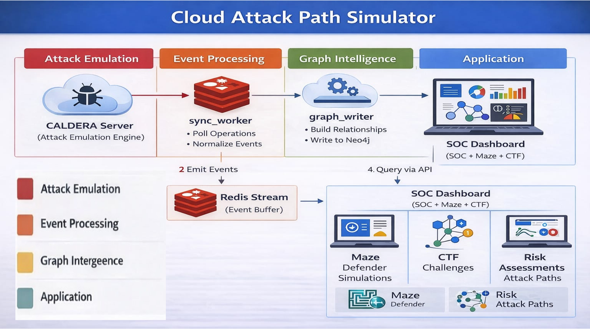
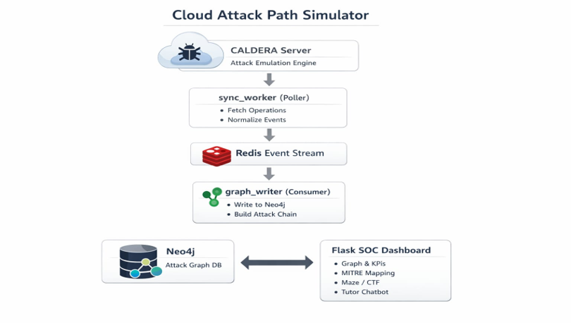
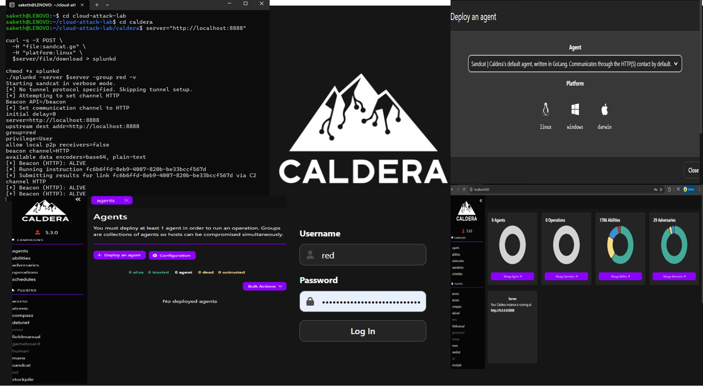
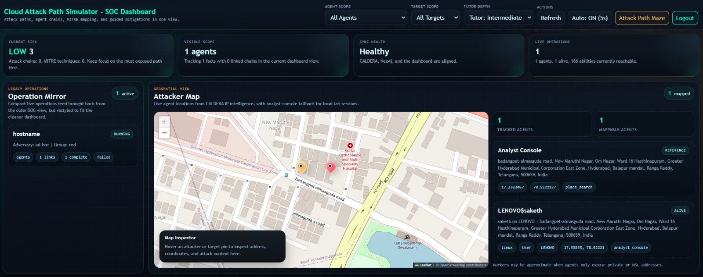
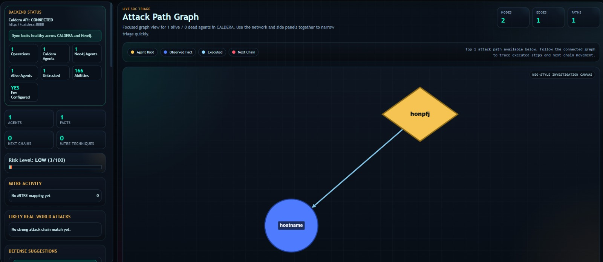
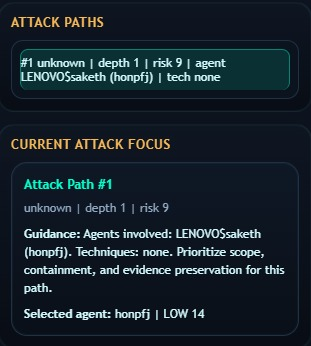
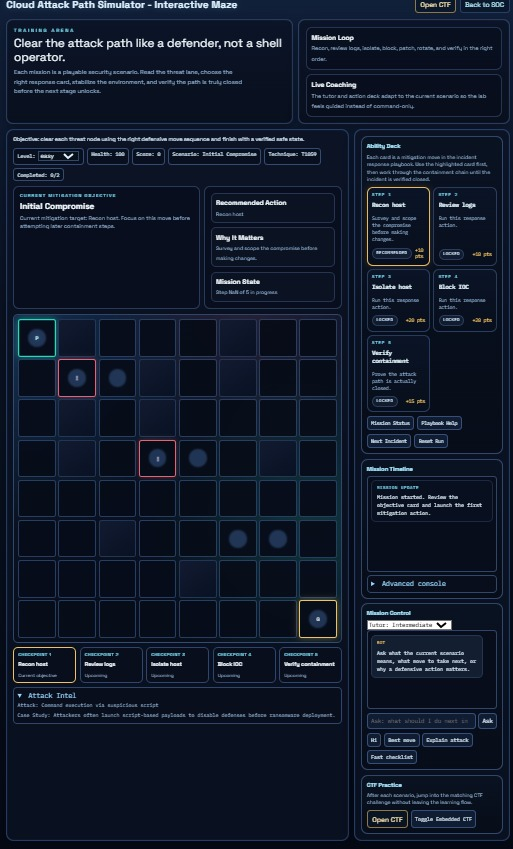
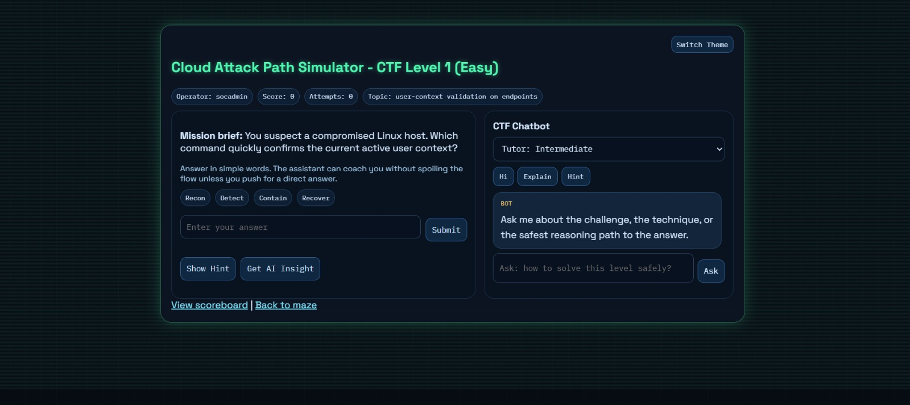

# Cloud Attack Path Simulator

Visual project representation for reviewers, faculty, and first-time GitHub visitors. For setup and runtime details, see [README_WORKING.md](/c:/Users/91895/Desktop/projects/cloud-attack-lab/README_WORKING.md).

## Project Summary

Cloud Attack Path Simulator is a SOC-focused cyber range platform that converts MITRE CALDERA attack activity into an attack graph, risk view, and guided defensive learning workflow. The project combines attack emulation, event processing, graph intelligence, and training modules in one platform.

## End-To-End Representation

### 1. Architecture Overview

This diagram presents the full platform story. CALDERA generates attack-emulation activity, `sync_worker` normalizes and forwards events, Redis acts as the event buffer, `graph_writer` builds the attack graph in Neo4j, and the final application layer exposes the SOC dashboard, Maze, CTF, and risk-analysis surfaces.

### 2. Data Pipeline

This view shows the implementation pipeline more directly. It explains how raw CALDERA operations move through a poller and stream-processing path before becoming graph-backed data in Neo4j and analyst-facing views in the Flask dashboard.

### 3. CALDERA Source Environment

This screenshot shows the upstream attack-emulation environment used to generate the activity seen in the project. It demonstrates the operational source of agents, commands, and adversary-execution context that later appears in the SOC dashboard.

### 4. SOC Dashboard Overview

This is the main analyst-facing workspace. It combines current risk, visible scope, sync health, live operations, and geospatial context in a single screen so the user can move from system status to investigation without leaving the dashboard.

### 5. Attack Graph

This image shows the core graph model in action. CALDERA execution has been transformed into connected graph entities, where an agent node is linked to an observed fact, allowing analysts to inspect path progression instead of isolated events.

### 6. Attack Focus And Triage

This panel highlights the ranked attack path and the currently selected triage focus. It adds analyst guidance on scope, containment, and evidence preservation, showing that the platform is built for response reasoning, not just graph rendering.

### 7. Interactive Maze Defender Mode

The Maze module converts attack-path understanding into guided defensive action. Users work through mitigation steps such as recon, log review, isolation, blocking, and verification so they can practice the correct order of response.

### 8. CTF Learner Mode

The CTF mode extends the project into student-friendly practice. It presents security questions, hinting, chatbot guidance, and tutor-depth control so learners can build reasoning skills alongside the analyst dashboard.

## What This Project Represents

- An attack-emulation to SOC-visibility pipeline
- A graph-based approach to attack-path reconstruction
- A training platform that joins analyst workflows with learning modules
- A reviewer-friendly demonstration system for cyber defense, MITRE ATT&CK mapping, and blue-team education

## Related Docs

- Visual project representation: [README.md](/c:/Users/91895/Desktop/projects/cloud-attack-lab/README.md)
- Technical working guide: [README_WORKING.md](/c:/Users/91895/Desktop/projects/cloud-attack-lab/README_WORKING.md)
- Screenshot context notes: [docs/SCREENSHOT_CONTEXTS.md](/c:/Users/91895/Desktop/projects/cloud-attack-lab/docs/SCREENSHOT_CONTEXTS.md)
- Friend handoff document: [docs/FRIEND_PROJECT_HANDOFF.md](/c:/Users/91895/Desktop/projects/cloud-attack-lab/docs/FRIEND_PROJECT_HANDOFF.md)
- Research paper brief: [docs/RESEARCH_PAPER_BRIEF.md](/c:/Users/91895/Desktop/projects/cloud-attack-lab/docs/RESEARCH_PAPER_BRIEF.md)

## Media And Copyright

Project screenshots, custom diagrams, and repository-authored explanatory media are copyright the repository owner unless otherwise noted.

Third-party product names, logos, map tiles, and trademarks visible inside screenshots, including CALDERA, Redis, Neo4j, Flask, Leaflet, and OpenStreetMap attribution, remain the property of their respective owners and are shown only to document integration, demonstration, and academic/project presentation.
