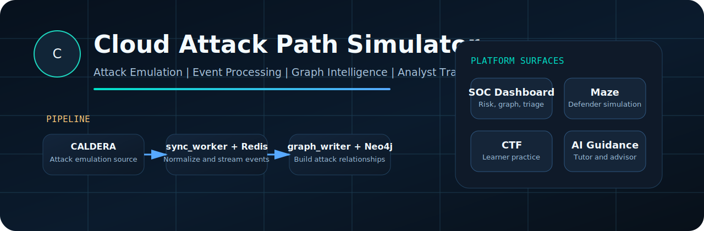

  
  <h1>Cloud Attack Path Simulator</h1>
  
<strong>A presentation-style cyber defense showcase for attack emulation, graph intelligence, analyst triage, and learner training.</strong>

  

    <a href="/c:/Users/91895/Desktop/projects/cloud-attack-lab/README_WORKING.md">Working Guide</a> |
    <a href="/c:/Users/91895/Desktop/projects/cloud-attack-lab/docs/FRIEND_PROJECT_HANDOFF.md">Friend Handoff</a> |
    <a href="/c:/Users/91895/Desktop/projects/cloud-attack-lab/docs/RESEARCH_PAPER_BRIEF.md">Research Brief</a>
  

## Project Vision

Cloud Attack Path Simulator is designed as a full project presentation, not just a code repository. The platform starts with MITRE CALDERA attack emulation, streams events through Redis-backed processing, builds relationships in Neo4j, and turns the result into a SOC dashboard with attack graphs, risk views, triage guidance, Maze missions, and CTF learning.

## Why This Project Matters

<table>
  <tr>
    <td width="33%">
      <h3>Problem</h3>
      Security demos often show commands or alerts, but not the connected attack path.
    </td>
    <td width="33%">
      <h3>Solution</h3>
      This project reconstructs attacker behavior as a graph-backed SOC workflow with MITRE context.
    </td>
    <td width="33%">
      <h3>Outcome</h3>
      Reviewers can understand how activity is generated, processed, visualized, and taught in one platform.
    </td>
  </tr>
</table>

## Presentation Flow

<table>
  <tr>
    <td width="25%"><strong>1. Attack Emulation</strong> CALDERA produces adversary activity and agent context.</td>
    <td width="25%"><strong>2. Event Processing</strong> <code>sync_worker</code> and Redis normalize and buffer telemetry.</td>
    <td width="25%"><strong>3. Graph Intelligence</strong> <code>graph_writer</code> stores relationships in Neo4j.</td>
    <td width="25%"><strong>4. User Experience</strong> SOC, Maze, CTF, and AI guidance present the result.</td>
  </tr>
</table>

## Architecture Story

<table>
  <tr>
    <td width="50%">
      
    </td>
    <td width="50%">
      
    </td>
  </tr>
  <tr>
    <td>
      <strong>Architecture Overview</strong> 
      The full platform view: CALDERA generates activity, Redis carries events, Neo4j stores the graph, and the application layer exposes SOC, Maze, CTF, and risk-assessment experiences.
    </td>
    <td>
      <strong>Implementation Pipeline</strong> 
      The actual service flow: CALDERA -> <code>sync_worker</code> -> Redis Stream -> <code>graph_writer</code> -> Neo4j <-> Flask dashboard.
    </td>
  </tr>
</table>

## Source To Visibility

<table>
  <tr>
    <td width="45%">
      
    </td>
    <td width="55%">
      <h3>CALDERA Source Environment</h3>
      This screenshot anchors the project in a real attack-emulation workflow. It shows the environment from which agents, commands, and operation activity originate before they are transformed into graph-backed SOC intelligence.
        
      <strong>Key message:</strong> the project is not based on fake static screenshots alone; it is fed by a real upstream attack-simulation source.
    </td>
  </tr>
</table>

## Analyst Experience

<table>
  <tr>
    <td width="100%">
      
    </td>
  </tr>
  <tr>
    <td>
      <strong>SOC Dashboard Overview</strong> 
      This is the main analyst-facing workspace. It combines current risk, sync health, visible scope, operation feed, and map context so a user can move from platform status to investigation within one interface.
    </td>
  </tr>
</table>

<table>
  <tr>
    <td width="68%">
      
    </td>
    <td width="32%">
      
    </td>
  </tr>
  <tr>
    <td>
      <strong>Attack Graph</strong> 
      CALDERA execution is converted into connected graph entities, allowing analysts to inspect how an agent and an observed fact form an attack path instead of reading disconnected alerts.
    </td>
    <td>
      <strong>Attack Focus</strong> 
      Ranked path summaries and guidance help the analyst prioritize containment, evidence preservation, and triage around the most relevant path.
    </td>
  </tr>
</table>

## Training And Learning Extensions

<table>
  <tr>
    <td width="50%">
      
    </td>
    <td width="50%">
      
    </td>
  </tr>
  <tr>
    <td>
      <strong>Maze Defender Mode</strong> 
      Attack-path knowledge is turned into a guided mitigation mission where the user practices recon, review, isolation, blocking, and verification in the correct response order.
    </td>
    <td>
      <strong>CTF Learner Mode</strong> 
      The platform also supports student practice through challenge-based learning, hints, tutor depth, and chatbot-assisted explanation.
    </td>
  </tr>
</table>

## What This Repository Represents

- A complete attack-emulation to SOC-visibility pipeline
- A graph-based approach to attack-path reconstruction
- A project presentation suitable for GitHub, demos, and faculty review
- A combined analyst-and-learner platform instead of a single-view dashboard

## Quick Access

- Visual project landing page: [README.md](/c:/Users/91895/Desktop/projects/cloud-attack-lab/README.md)
- Technical setup and runtime guide: [README_WORKING.md](/c:/Users/91895/Desktop/projects/cloud-attack-lab/README_WORKING.md)
- Screenshot context notes: [docs/SCREENSHOT_CONTEXTS.md](/c:/Users/91895/Desktop/projects/cloud-attack-lab/docs/SCREENSHOT_CONTEXTS.md)
- Friend handoff packet: [docs/FRIEND_PROJECT_HANDOFF.md](/c:/Users/91895/Desktop/projects/cloud-attack-lab/docs/FRIEND_PROJECT_HANDOFF.md)
- Research paper brief: [docs/RESEARCH_PAPER_BRIEF.md](/c:/Users/91895/Desktop/projects/cloud-attack-lab/docs/RESEARCH_PAPER_BRIEF.md)

## Media And Copyright

Project screenshots, custom diagrams, and repository-authored explanatory media are copyright the repository owner unless otherwise noted.

Third-party product names, logos, map tiles, and trademarks visible inside screenshots, including CALDERA, Redis, Neo4j, Flask, Leaflet, and OpenStreetMap attribution, remain the property of their respective owners and are shown only to document integration, demonstration, and academic/project presentation.
